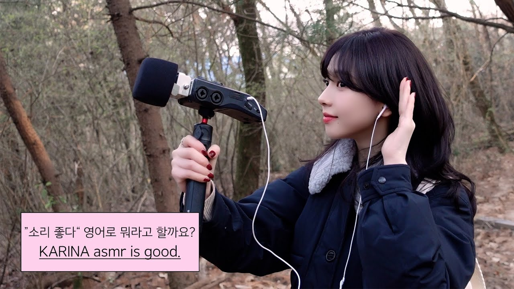

# Karina Voice Notification Generator

<p align="center">
  
  
  
  
  
  <a href="README.ko.md"></a>
</p>

<p align="center">
  
</p>

Generate Claude Code notification sounds with **aespa Karina's voice** using AI voice cloning technology.

> **What is this?** Custom notification sounds that play when Claude Code needs your attention - permission requests, task completion, and more.

> **Use Any Voice!** While this project defaults to Karina's voice, you can use **any YouTube video** as a voice source. Clone your favorite idol, voice actor, streamer, or even your own voice!

---

## Quick Setup (Using Pre-generated Audio)

### 1. Copy Audio Files

```bash
mkdir -p ~/.claude/sounds
cp output/notifications/*/*.wav ~/.claude/sounds/
```

### 2. Install Hook Script

```bash
mkdir -p ~/.claude/hooks
cp src/claude_notification_hook.py ~/.claude/hooks/
chmod +x ~/.claude/hooks/claude_notification_hook.py
```

### 3. Configure Claude Code

Add to `~/.claude/settings.json`:

```json
{
  "hooks": {
    "Notification": [
      {
        "hooks": [
          {
            "type": "command",
            "command": "python3 ~/.claude/hooks/claude_notification_hook.py",
            "timeout": 10
          }
        ]
      }
    ],
    "Stop": [
      {
        "hooks": [
          {
            "type": "command",
            "command": "python3 ~/.claude/hooks/claude_notification_hook.py",
            "timeout": 10
          }
        ]
      }
    ]
  }
}
```

---

## Notification Types

| Type | When it plays |
|------|---------------|
| `permission_prompt` | Claude asks permission before risky commands |
| `idle_prompt` | Task complete, waiting for response |
| `auth_success` | Authentication successful |
| `elicitation_dialog` | User input required |
| Stop event | Claude response complete |

Each notification type has 10 voice variations that play randomly.

---

## Customization

### Change Notification Phrases

Edit `notification_lines.json`:

```json
{
  "permission_prompt": [
    {"text": "Your custom phrase here", "filename": "permission_prompt_1.wav"}
  ]
}
```

---

## Generating New Audio (GPU Required)

### Requirements

**Linux (NVIDIA GPU)**
- NVIDIA GPU with CUDA support (A100 recommended)
- CUDA 12.0+
- [pixi](https://pixi.sh) package manager

**macOS (Apple Silicon)**
- Mac with M1/M2/M3/M4 chip
- 64GB RAM recommended (32GB minimum)
- [pixi](https://pixi.sh) package manager

### Choosing a Good Voice Sample

> **Important**: For best results, choose a YouTube video with **voice only** (no background music).

**Good sources:**
- Interview clips
- Solo speaking segments
- Behind-the-scenes talking moments

**Avoid:**
- Music videos
- Clips with background music
- Noisy environments

---

## Troubleshooting

### Hook not playing sounds
- Check that audio files exist in `~/.claude/sounds/`
- Verify the hook script has execute permissions
- Check `~/.claude/hooks/hook_debug.log` for errors

### Poor voice quality
- Use a cleaner voice sample without background music
- Ensure the reference audio is 5-15 seconds
- Try a different segment from the source video

---

## Project Structure

```
project-karina-voice/
├── src/
│   ├── pipeline.py              # Main pipeline
│   ├── claude_notification_hook.py # Claude hook
│   └── ...
├── output/
│   └── notifications/           # Generated sounds
├── notification_lines.json      # Phrase configuration
└── pixi.toml                    # Dependencies
```

---

## License

MIT License
